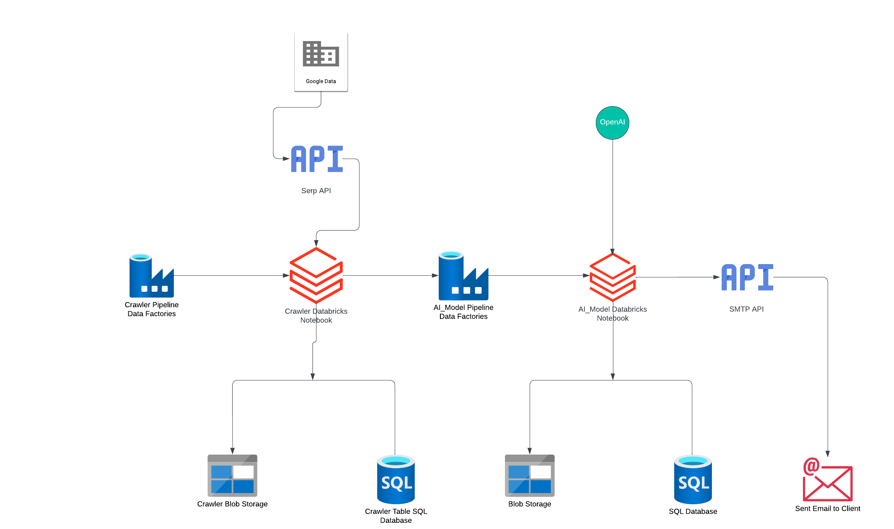

# AI-Powered Counterfeit Detection System 🚀

## Overview
Counterfeit product detection is crucial in protecting intellectual property (IP). 
This project, developed in collaboration with **RegHub** for **BluePort Legal**, 
leverages **AI, ETL Pipelines, and Azure Cloud** to detect counterfeit football merchandise 
for German clubs. 

The system integrates **Machine Learning, Web Scraping, and Azure Cloud** for 
real-time detection and compliance reporting.

## Project Highlights
✅ **Data Collection & Ingestion**: Web scraping e-commerce platforms using `SERP API`, `Scrapy`, `Requests`.  
✅ **Data Processing & Storage**: Apache Spark & Databricks ETL pipeline, stored in `Azure SQL` & `Azure Blob Storage`.  
✅ **AI Model**: LLM-powered counterfeit detection (GPT & NLP techniques).  
✅ **Deployment**: Automated with `Azure Data Factory (ADF)` & CI/CD pipelines (`Azure DevOps`).  
✅ **Client Feedback Loop**: Continuous model improvement through regulatory expert feedback.  

## Technologies Used
- **Cloud**: Microsoft Azure (ADF, SQL, Blob Storage, Machine Learning, DevOps)
- **Big Data & ETL**: Apache Spark, Databricks, PySpark
- **AI & ML**: LLMs (GPT-based), NLP techniques for counterfeit detection
- **Streaming**: Kafka for real-time product ingestion
- **Web Scraping**: Scrapy, BeautifulSoup, Requests
- **CI/CD**: Azure DevOps Pipelines

## System Architecture

## Key Features
🔹 Automated AI-based counterfeit detection in e-commerce listings  
🔹 Compliance-focused product validation and risk assessment  
🔹 CI/CD-enabled cloud deployment with real-time monitoring  

---

## Future Enhancements
- Extend the model to more global e-commerce platforms.
- Enhance image-based counterfeit detection.
- Implement blockchain-based product verification.

**📢 Looking forward to collaborating on AI-powered risk management and compliance automation!**

---
## Contact  
🔗 [LinkedIn](https://www.linkedin.com/in/agarwalankur574/)  
✉️ Email: ananya.agrawal2209@gmail.com  
